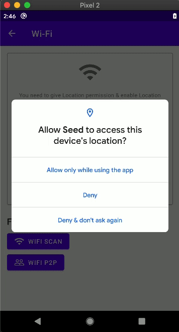
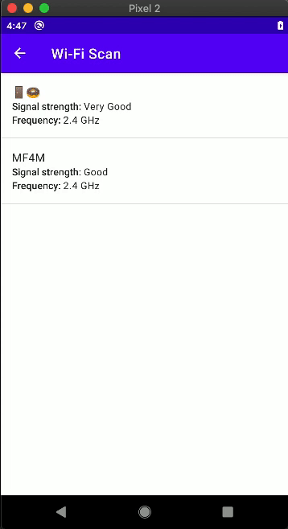
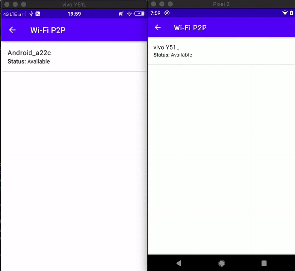
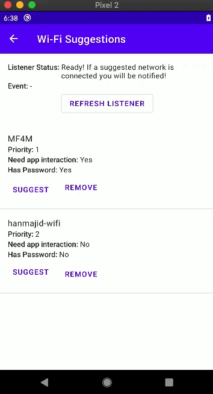

# android.reservoir

🚀 *Still in development* 🚀

## About

Collection of various Android sample projects. Each project contains an example of how to do particular tasks in Android. Here's the list of available projects:

1. Connectivity > Wi-Fi
   - Wi-Fi state & connected Wi-Fi information
   - Wi-Fi scanning
   - Wi-Fi suggestions
   - Wi-Fi P2P (Direct)
2. ...

## Screenshots

### 1. Connectivity > Wi-Fi

|     |     |
| :-: | :-: |
| Check Wi-Fi state, connected Wi-Fi information, & P2P support  | Wi-Fi scanning & show connected Wi-Fi |
|  |  |
| Transfer data via Wi-Fi Direct (P2P) | Suggesting Wi-Fi and Auto-fill Wi-Fi password |
|  |  |

## Version

1.0
