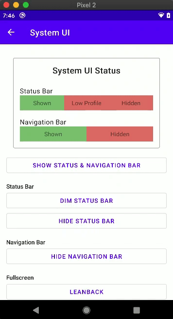
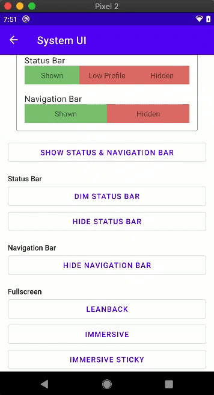

# android.reservoir

🚀 *Still in development* 🚀

## About

Collection of various Android sample projects. Each project contains an example of how to do particular tasks in Android. Here's the list of available projects:

1. Connectivity > Wi-Fi
   - Wi-Fi state & connected Wi-Fi information
   - Wi-Fi scanning
   - Wi-Fi suggestions
   - Wi-Fi P2P (Direct)
2. User Interface
   - System UI
     - Show, hide (immersive sticky or default (immersive)), & dim status bar
     - Show & hide (leanback, immersive, or immersive sticky) navigation bar
     - Fullscreen (leanback, immersive, or immersive sticky)
     - Listen to system UI visibility changes
3. ... 

## Screenshots

### 1. Connectivity > Wi-Fi

|     |     |
| :-: | :-: |
| Check Wi-Fi state, connected Wi-Fi information, & P2P support  | Wi-Fi scanning & show connected Wi-Fi |
|  |  |
| Transfer data via Wi-Fi Direct (P2P) | Suggesting Wi-Fi and Auto-fill Wi-Fi password |
|  |  |

### 2. User Interface > System UI

|     |     |
| :-: | :-: |
| Show, hide, & dim status bar  | Show & hide navigation bar |
|  |  |
| Fullscreen (leanback, immersive, or immersive sticky) | |
|  | |

## Version

1.0
